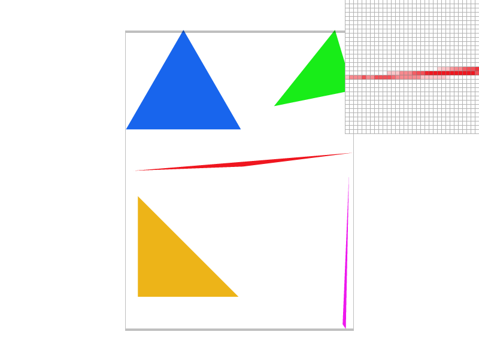
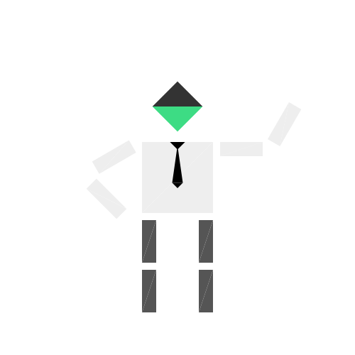
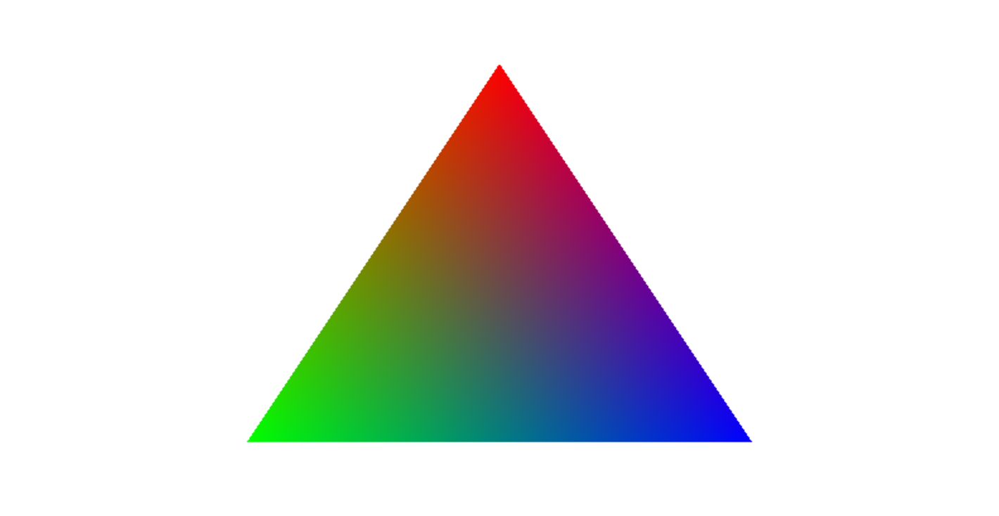
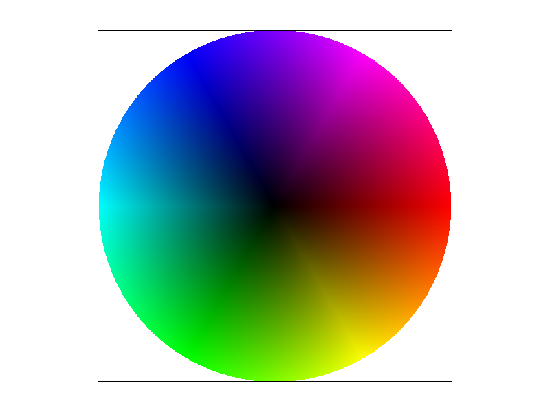
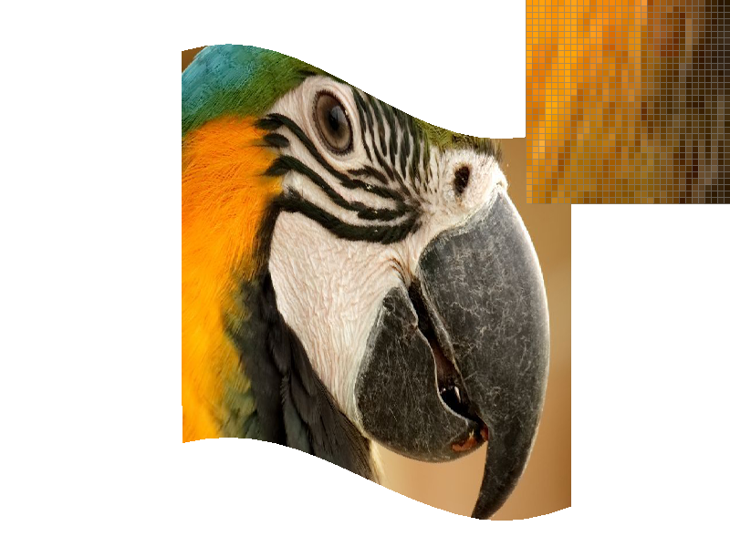

# rasterizer

Run the executable with the command  
`./draw [path to .svg file/folder of multiple .svg to render]`  

<table>
<thead>
<tr>
<th style="text-align:center">Key</th>
<th>Action</th>
</tr>
</thead>
<tbody>
<tr>
<td style="text-align:center"><kbd>space</kbd></td>
<td>return to original viewpoint</td>
</tr>
<tr>
<td style="text-align:center"><kbd>-</kbd></td>
<td>decrease sample rate</td>
</tr>
<tr>
<td style="text-align:center"><kbd>=</kbd></td>
<td>increase sample rate</td>
</tr>
<tr>
<td style="text-align:center"><kbd>Z</kbd></td>
<td>toggle the pixel inspector</td>
</tr>
<tr>
<td style="text-align:center"><kbd>P</kbd></td>
<td>switch between texture filtering methods on pixels</td>
</tr>
<tr>
<td style="text-align:center"><kbd>L</kbd></td>
<td>switch between texture filtering methods on mipmap levels</td>
</tr>
<tr>
<td style="text-align:center"><kbd>S</kbd></td>
<td>save a <em>PNG</em> image screenshot in the current directory</td>
</tr>
<tr>
<td style="text-align:center"><kbd>1</kbd> - <kbd>9</kbd></td>
<td>switch between svg files in the loaded directory</td>
</tr>
</tbody>
</table>


## **Contents** <!-- omit in toc -->

- [**Overview**](#overview)
- [**Rasterization**](#rasterization)
  - [**Rasterizing single-color triangles**](#rasterizing-single-color-triangles)
  - [**Antialiasing triangles**](#antialiasing-triangles)
- [**Sampling**](#sampling)
  - [**Transforms**](#transforms)
  - [**Barycentric coordinates**](#barycentric-coordinates)
  - [**"Pixel sampling" for texture mapping**](#pixel-sampling-for-texture-mapping)
  - [**"Level sampling" with mipmaps for texture mapping**](#level-sampling-with-mipmaps-for-texture-mapping)

## **Overview**
The purpose of this project was to implement a simple rasterizer that can handle simplified [Scalable Vector Graphics (SVG)](https://en.wikipedia.org/wiki/Scalable_Vector_Graphics) files.  
The bulk of the work in this project is to implement several features such as [supersampling](https://en.wikipedia.org/wiki/Supersampling), [matrix transforms](https://en.wikipedia.org/wiki/Transformation_matrix#Examples_in_2_dimensions), [barycentric coordinates](https://en.wikipedia.org/wiki/Barycentric_coordinate_system), pixel sampling, and [level sampling with mipmaps](https://en.wikipedia.org/wiki/Mipmap).  

I completed this project alone.

## **Rasterization**

A [rasterizer](https://en.wikipedia.org/wiki/Rasterisation) is a program that an image described in vector graphics and converts it into a series of pixels that can be displayed on a screen.  
After this project is built, the executable for the rasterizer can be ran with:  ```./draw [path to svg file/folder to render```  
When the executable is run, a couple things happen:  

1. An **SVGParser** (```svgparser.h/cpp```) reads the input ```.svg``` files.
2. An **OpenGL viewer** containing a **DrawRend** (```drawrend.h/cpp```) renderer is launched.
3. The viewer waits for mouse/keyboard input in an infinite loop.
4. ```DrawRend::redraw()``` performs high-level drawing work through the various **SVGElement** child classes, which pass their low-level shape rasterization data to appropraite methods in the **Rasterizer** class.

### **Rasterizing single-color triangles**

The first task in the assignment was to implement triangle rasterization.  
The simplest way to do this is to simply check whether or not each pixel is inside or outside of the triangle. This is called sampling.  
In this project, each ```(x,y)``` pixel's sample point is in its center: ```(x+.5, y+.5)```. This isn't that important right now, it's just the convention that was chosen.  
Another convention that is followed in this project is that a sample that is directly on a triangle boundary will be drawn by the rasterizer.  
Luckily, a formula for determining if a point is inside a triangle is already well known:  
$$\text{Consider some triangle defined by the points }$$
$$A = (x_0, y_0)$$
$$B = (x_1, y_1)$$
$$C = (x_2, y_2)$$
$$\text{A point } P = (x,y) \text{ is inside the triangle if the vectors}$$
$$\vec{AB} \times \vec{AP},  \vec{AB} \times \vec{AP} \text{ and } \vec{AB} \times \vec{AP}$$
$$\text{all point in the same direction relative to the plane.}$$
$$\text{(when the z-component of each vector has the same sign)}$$
The intuition for this comes from the right hand rule. Notice that the z-component of the cross products only have to have the same sign; an intuitive way to think of this is that if you traverse a triangle in a counterclockwise direction, a point inside the triangle will appear to be to the left of the edges. If you traverse a triangle the otherway, an inner point will appear to be to the right of the edges.

#### **Improving speed**  <!-- omit in toc -->

There are a few ways of improving the speed of the rasterization.  
It's not very efficient to sample every single pixel: consider the case of a very small triangle that's rasterized for a very large amount of pixels.  
The simplest way to cut down on the number of samples is to simply find a rectangle that the triangle is bounded by, and only sample pixels in the rectangle.  
Intuitively, we know that all the points inside a triangle won't have $x$/$y$ values less than/greater than the minimum/maximum $x$/$y$ values of its vertices. So, we can define a rectangle by the minimum and maximum coordinate values of the triangle, and only sample from that rectangle.  

### **Antialiasing triangles**

Jagged edges on polygons are the result of [aliasing](https://en.wikipedia.org/wiki/aliasing). In order to smooth these "jaggies", we need to implement some form of anti-aliasing.  
If you are trying to represent some image on a screen, the solution from task 1 was to just take a sample of each pixel and if the pixel was inside the polygon, it was displayed. How can we display a more accurate image without simply adding more pixels?  
Well, even if you don't have more pixels, you can still sample more! If you take more than one sample per pixel, you can average them to have a more accurate value for your pixels! This is called [supersampling](https://en.wikipedia.org/wiki/Supersampling).  

#### **Implementation** <!-- omit in toc -->

In this project, super smapling was achieved through by rasterizing a higher resolution image to a (larger) sample buffer, then downsampling from the sample buffer to the display buffer. The sample buffer is a vector that holds `width * height * sample_rate` Color objects. The frame buffer holds `3 * width * height` RGB values, since each pixel has a red, green, and blue value. Basically, when any `rasterize` function is called, it will sample points determined by the `sample_rate` and populate the sample buffer with the samples. Then, `resolve_to_framebuffer` is called to downsample from `sample_buffer` to the `frame_buffer` by averaging the `sample_rate` number of supersamples.

Here, you can see how taking more samples and averaging the results helps remove aliasing.

|  |  |  |
|:--:|:--:|:--:|
| *1x sampling* | *4x supersampling* | *16x supersampling* |

## **Sampling**

### **Transforms**

Part of this assignment was to implement matrix transforms. These included rotations, translations, and scaling. I used these transformations to edit an SVG image of a robot to make him more human. I gave him a tie, some slacks, and a hat. Also, he's waving at you!  

|  |  |
|:--:|:--:|
| *Before* | *After* |  
  
### **Barycentric coordinates**

[Barycentric coordinates](https://en.wikipedia.org/wiki/Barycentric_coordinate_system) are coordinates that are defined in relation to the vertices of a triangle.  
Basically, the idea is that you specify a location based on how far it is from each vertex. If you give each vertex some weight or value, you can think of barycentric coordinates as representing the "contribution" each vertex has to the overall value of the point. Formally, it's defined like this:  
$$\text{For a triangle } ABC,$$
$$\text{P = ($\alpha, \beta, \gamma$)}$$
$$\alpha + \beta + \gamma = 1$$
$$P = \alpha A + \beta B + \gamma C$$
The pictures below give a visual idea of how points on a triangle can be thought of as the sum of each vertex's "contribution.  
Both the shapes have a clear red, green, or blue region. Using barycentric coordinates, the surface of the shapes were able to be colored by a process called linear interpolation, which resulted in a smooth transition between the colors.

|  |  |
|:--:|:--:|
| *Color interpolated triangle* | *Color interpolated circle* |  

### **"Pixel sampling" for texture mapping**

So far in the project, we have been drawing shapes and coloring them with colors specified either in source code, or in the SVG files. However, what if we drew the inside of a house? Would it make sense to draw and define the color values of all the walls, or all the floor tiles?  No! All the walls usually look like each other, and all the floor tiles look like each other. So, it's easier and more efficient to have a general image of what those things are supposed to look like, and then **sample** from those images! This is called **texture mapping**!  

There's various ways to actually implement texture mapping. The two ways were were asked to implement texture mapping was *nearest neighbor* and *bilinear*.

- **Nearest Neighbor**: After determining the texture coordinates $(u,v)$ by barycentric coordinates, we just scale the coordinates by the texture image dimensions, then round to the nearest pixel in the texture.

- **Bilinear** : Bilinear filtering basically takes the four closest pixels to the $(u,v)$ and determines a weighted average based on the position of $(u,v)$ relative to the four pixels.

|  |  |
|:--:|:--:|
| *Nearest neighbor, 1x* | *Nearest neighbor, 16x* |  

|  |  |
|:--:|:--:|
| *Bilinear, 1x* | *Bilinear, 16x* |

It's a bit subtl, but you can see that there is less noise when using bilinear filtering. Fine features like hair, or feathers in this case, blend more nicely. Bilinear filtering generally helps smooth out high frequency details.

### **"Level sampling" with mipmaps for texture mapping**

Just like with rasterizing images, texture mapping can suffer from aliasing issues. Specifically, with texture mapping, these issues a rooted in the difficults that come with trying to scale and transform a texture to properly fit a surface. Level sampling is a technique to mitigate these issues by storing different levels (mipmaps) of filtered and down-sampled textures, using the different levels depending on the distance of the surface.  
In this project, there are two types of level sampling beyond just using the full resolution texture.  

- **Nearest level sampling**: similar to nearest pixel sampling. This uses the level texture that is closest to the calculated level.

- **Bilinear level sampling**: similar to bilinear pixel sampling. Instead of rounding, this uses a weighted sum of the two levels that contribute to the frame.

The calculation of the level $D$ is as follows:

$$D = log_2L$$
$$L = max \left(\sqrt{\frac{du^2}{dx} + \frac{dv^2}{dx}}, \sqrt{\frac{du^2}{dy} + \frac{dv^2}{dy}}\right)$$

With all the tasks complete, the renderer is able to select from 2 different pixel sampling and 3 different level sampling methods with 1x to 16x supersampling. There are various tradeoffs between speed, memory usage, and antialiasing for these techniques. The fastest and most memory efficient techniques are those that take the least amount of samples, and that perform the least amount of calculations per sample.  

The slowest performance but best antialiasing will be achieved by bilinear pixel and level filtering in conjunction with 16x supersampling. On the other end, we can achieve the best performance by choosing nearest neighbor pixel sampling, zero level sampling, and 1x supersampling.

Here's what some of the different combinations look like:

|  |  |
|:--:|:--:|
| *zero level, nearest pixel* | *zero level, bilinear pixel* |  

|  |  |
|:--:|:--:|
| *nearest level, nearest pixel* | *nearest level, bilinear pixel* |
